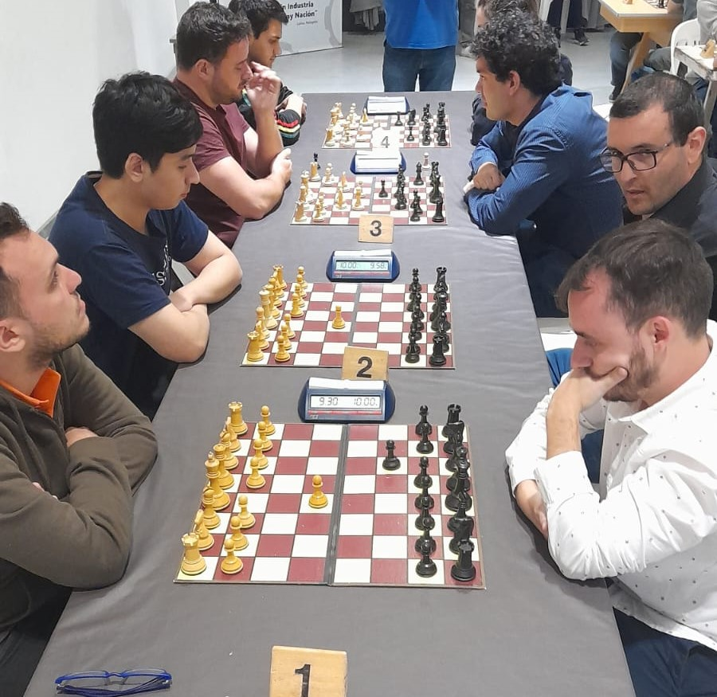

# MIRAS, LAUTARO

+ En mi tiempo libre soy ajedrecista (1837 FIDE).
- Mi expectativa es ser un excelente profesional.
- Tengo un amor-odio por las matematicas.
- Tengo 2 perros.
- La última pelicula que vi fue Bob Esponja.
> La grandeza del hombre está en ser un puente y no una meta: lo que en el hombre se puede amar es un tránsito y un ocaso -Friedrich Nietzsche

